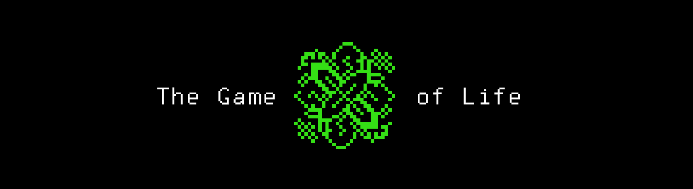

# The Game of Life
A clone of the cellular automaton "The Game of Life", implemented in the C language and running in the computer terminal.

 

&nbsp;

## General information.

* Rules:

> After starting the game, the user must choose one of five options for the initial state of the field.

> If the user wants to change the initial state of the field, he must edit one of the five files in the "files" folder and select it when the game starts.

> When the all population dies or the user presses the "q" button, the game ends.

* Graphics:

> The field is a 80 x 25-symbol rectangle.

> It is assumed that the field is "closed to itself", for example, in the lower right square, the neighbor on the right is the lower left square, and the neighbor on the bottom is the upper right; 

## History

&nbsp;

&nbsp;

>The Game of Life, also known simply as Life, is a cellular automaton devised by the British mathematician John Horton Conway in 1970. It is a zero-player game, meaning that its evolution is determined by its initial state, requiring no further input. One interacts with the Game of Life by creating an initial configuration and observing how it evolves. It is Turing complete and can simulate a universal constructor or any other Turing machine.
>
>The universe of the Game of Life is an infinite, two-dimensional orthogonal grid of square cells, each of which is in one of two possible states, live or dead, (or populated and unpopulated, respectively). Every cell interacts with its eight neighbours, which are the cells that are horizontally, vertically, or diagonally adjacent. At each step in time, the following transitions occur:
>
>Any live cell with fewer than two live neighbours dies, as if by underpopulation.
>Any live cell with two or three live neighbours lives on to the next generation.
>Any live cell with more than three live neighbours dies, as if by overpopulation.
>Any dead cell with exactly three live neighbours becomes a live cell, as if by reproduction.
>These rules, which compare the behavior of the automaton to real life, can be condensed into the following:
>
>Any live cell with two or three live neighbours survives.
>Any dead cell with three live neighbours becomes a live cell.
>All other live cells die in the next generation. Similarly, all other dead cells stay dead.
>The initial pattern constitutes the seed of the system. The first generation is created by applying the above rules simultaneously to every cell in the seed; births and deaths occur simultaneously, and the discrete moment at which this happens is sometimes called a tick. Each generation is a pure function of the preceding one. The rules continue to be applied repeatedly to create further generations.
>
>Since its publication, the Game of Life has attracted much interest because of the surprising ways in which the patterns can evolve. It provides an example of emergence and self-organization. Scholars in various fields, such as computer science, physics, biology, biochemistry, economics, mathematics, philosophy, and generative sciences, have made use of the way that complex patterns can emerge from the implementation of the game's simple rules. The game can also serve as a didactic analogy, used to convey the somewhat counter-intuitive notion that design and organization can spontaneously emerge in the absence of a designer. For example, cognitive scientist Daniel Dennett has used the analogy of the Game of Life "universe" extensively to illustrate the possible evolution of complex philosophical constructs, such as consciousness and free will, from the relatively simple set of deterministic physical laws which might govern our universe.
>
>The popularity of the Game of Life was helped by its coming into being at the same time as increasingly inexpensive computer access. The game could be run for hours on these machines, which would otherwise have remained unused at night. In this respect, it foreshadowed the later popularity of computer-generated fractals. For many, the Game of Life was simply a programming challenge: a fun way to use otherwise wasted CPU cycles. For some, however, the Game of Life had more philosophical connotations. It developed a cult following through the 1970s and beyond; current developments have gone so far as to create theoretic emulations of computer systems within the confines of a Game of Life board.
>
> Source: https://en.wikipedia.org/wiki/Conway%27s_Game_of_Life
>
&nbsp;

 
<i>created by Egor Oleynik in September 2021</i>

